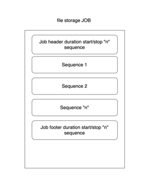

## Sequence Management

This module will get the Sequence from the gui and store into the array.

## Sample management or job management

Every sample in the system comprises of:

* Header: mean all information before start the samples and target information expected.
* Séquence datlogger: log all problem during sample and all sensor value during sample. It can send alert and alarm to gsm also.
* resume: mean all the target value compared to real value. There is also all info about alert and so on

## Counters

Our sytem contains the various numbers of the counters. These counters are specific in natures and signifies the   specific state of the system. The following counters has been implemented

* Total liter counter: This counter signifies the number of total liters in the system. It constatly updated during the process.
* Total hour counter: This coundter signifies the number of hours the system has been worked on.
